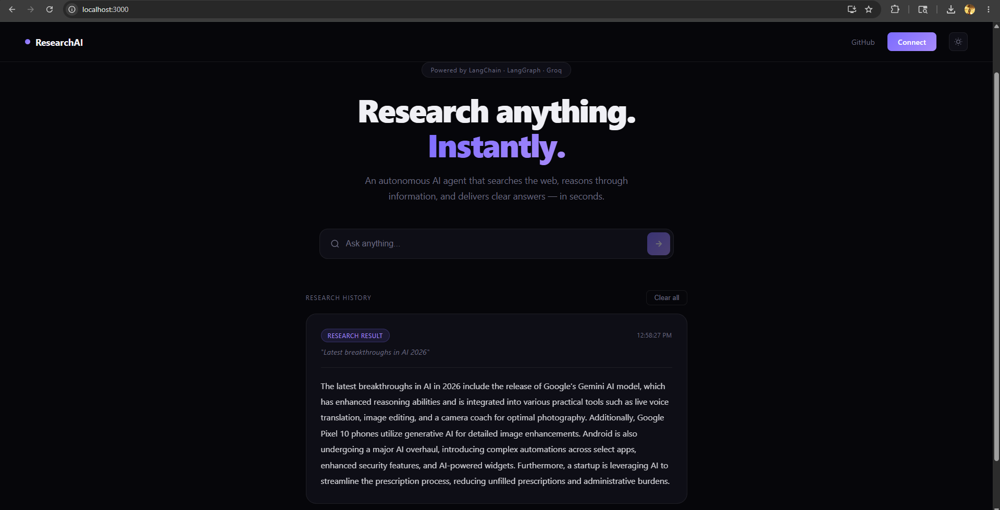
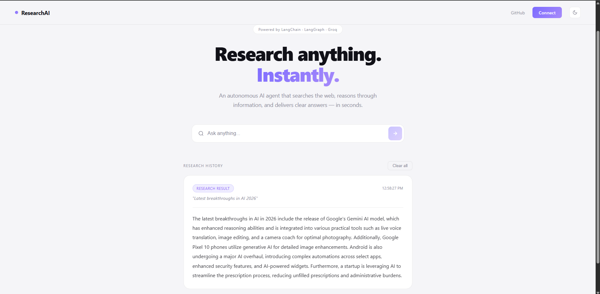

# Agentic Research Assistant

An autonomous AI research assistant that searches the live web, reasons 
through information, and delivers precise answers in seconds — built 
end-to-end with LangChain, LangGraph, Groq, FastAPI, and React.

---

## What It Does

Ask any question. The AI agent autonomously searches the internet using 
Tavily, reasons through the results using LLaMA 3.1 on Groq, and returns 
a clean, accurate answer — without you having to read through multiple 
tabs or links.

---

## Tech Stack

| Layer | Technology |
|---|---|
| AI Agent | LangChain + LangGraph |
| LLM | LLaMA 3.1 70B via Groq |
| Web Search | Tavily Search API |
| Backend | FastAPI + Python |
| Frontend | React.js |
| Styling | Custom CSS with dark/light theme |

---

## Features

- Autonomous multi-step web search and reasoning
- Real-time answers from the live internet
- Stop search mid-way with a single click
- Full research history saved in session
- Dark and light theme toggle
- Clean, responsive UI built from scratch
- Dockerizable backend

---

## Getting Started

### Prerequisites

- Python 3.11+
- Node.js 18+
- Groq API key — free at https://console.groq.com
- Tavily API key — free at https://tavily.com

---

### Backend Setup

```bash
cd backend
python -m venv venv
venv\Scripts\activate        # Windows
source venv/bin/activate     # Mac/Linux
pip install -r requirements.txt
```

Create a `.env` file inside the `backend` folder:

GROQ_API_KEY=your_groq_key_here
TAVILY_API_KEY=your_tavily_key_here

Start the backend:

```bash
python -m uvicorn main:app --reload
```

Backend runs at `http://127.0.0.1:8000`
API docs available at `http://127.0.0.1:8000/docs`

---

### Frontend Setup

```bash
cd frontend
npm install
npm start
```

Frontend runs at `http://localhost:3000`

---

## Project Structure
agentic-research-assistant/
├── backend/
│   ├── agents/
│   │   └── research_agent.py   ← LangGraph agent + Groq LLM + Tavily
│   ├── main.py                 ← FastAPI server + CORS + endpoints
│   └── requirements.txt
├── frontend/
│   ├── src/
│   │   ├── App.js              ← React UI + theme + history + stop
│   │   └── App.css             ← Full custom styling
└── README.md

---

## API Endpoints

| Method | Endpoint | Description |
|---|---|---|
| GET | `/` | Health check |
| GET | `/health` | Server status |
| POST | `/research` | Run agent with a query |

### Example Request

```json
POST /research
{
  "query": "What is the latest in AI research 2026?"
}
```

### Example Response

```json
{
  "result": "The latest AI research in 2026 includes...",
  "status": "success"
}
```

---

## How It Works
User types a question
↓
React frontend sends POST to FastAPI
↓
FastAPI passes query to LangGraph agent
↓
Agent decides search query → calls Tavily
↓
Tavily searches the live web → returns results
↓
LLaMA 3.1 on Groq reasons through results
↓
Agent returns a clean, direct answer
↓
React displays the result with timestamp

---

## Screenshots

> Dark Mode


> Light Mode  


---

## Future Improvements

- [ ] Deploy backend on Railway
- [ ] Deploy frontend on Vercel
- [ ] Add memory so agent remembers previous questions
- [ ] Export research history as PDF
- [ ] Add voice input support
- [ ] Multi-agent collaboration for complex research

---

## Author

**Preetham Urs D**
*Building AI systems that think, act, and ship.*
B.Tech CSE — Artificial Intelligence & Data Science
REVA University, Bengaluru

[](https://linkedin.com/in/preethamurs)
[](https://github.com/preethamurs)

---

## License

MIT License — free to use, modify, and distribute.
